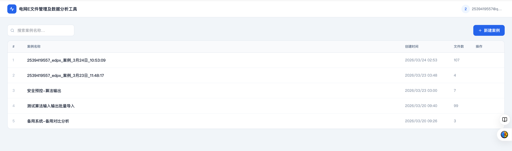
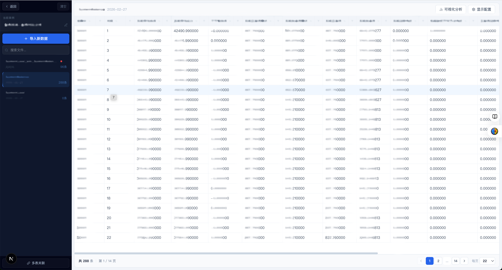
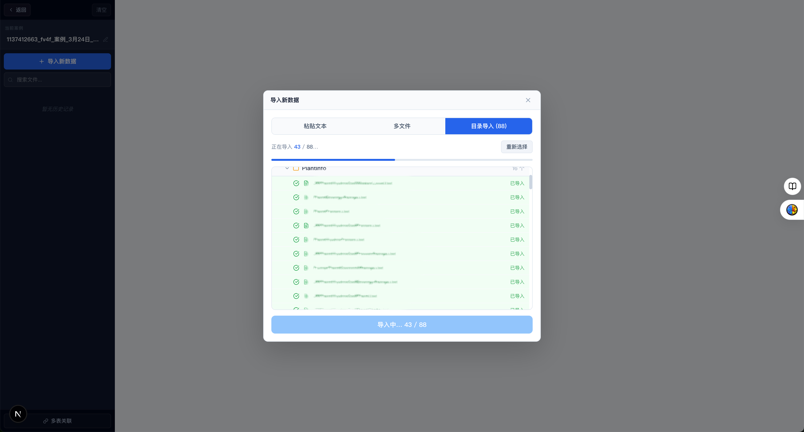
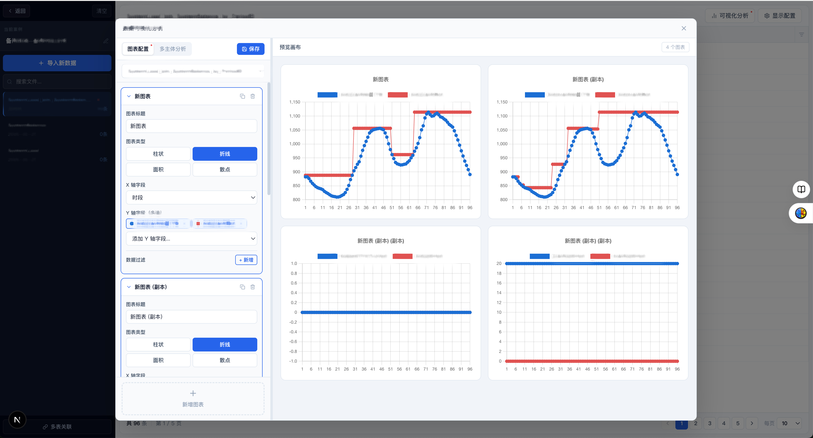

# E-File 解析与可视化平台

面向电网工程的 E-file 数据解析、管理与可视化分析系统。支持大文件导入、灵活的图表分析与多表关联。

---

## 系统截图

**案例列表**


**数据浏览工作区**


**数据导入**


**可视化分析**


**管理后台**


---

## 功能特性

### 用户与权限

- 邮箱 + 密码注册登录，JWT Cookie 鉴权，30 天有效期
- 管理员后台：用户管理（封禁/解封）、案例统计、全局数据概览
- 首个管理员通过 SQLite 命令直接授权：
  ```bash
  sqlite3 data/app.db "UPDATE profiles SET is_admin=1 WHERE email='your@email.com'"
  ```

---

### 案例管理

- 创建、重命名、删除工程案例
- 案例列表展示历史记录数

---

### 数据导入

- **文件导入**：支持单文件、批量文件、整个目录导入
- **文本粘贴**：直接粘贴 E-file 文本内容导入
- **大文件支持**：单文件最大 100 MB，服务端处理，不依赖浏览器内存
- **编码自动识别**：服务端自动检测 UTF-8 / GBK 编码，无需手动选择
- **行数截断保护**：超过 50 万行时自动截断，保留前 50 万行并在界面提示总行数
- **目录分组**：批量导入时按目录路径自动归组，侧边栏以文件夹树形式展示

---

### 数据浏览

- 分页表格展示，每页行数可选（10 / 22 / 35 / 50 / 100）
- **列头排序**：点击列名升序/降序切换，数值/文本自动识别排序逻辑
- **列头筛选**：每列独立多选筛选，支持搜索过滤 + 分页（10 项/页），筛选项列表支持升降序切换
- 底部状态栏展示筛选条件 chip，可逐条清除或一键重置
- 显示配置：按列勾选显示/隐藏，配置持久化保存
- 列标签（中文显示名）与字段名分离，界面显示中文标签

---

### 可视化分析

在工作区右上角「可视化分析」按钮进入，按钮及侧边栏对应记录项有红点提示已保存配置。

#### 图表配置模式

- 支持多个独立图表卡片，每张图可折叠/复制/删除
- 图表类型：柱状图 / 折线图 / 面积图 / 散点图
- X 轴、Y 轴（多选）字段自由配置
- 每张图独立数据过滤条件：字段 + 运算符（=、≠、>、≥、<、≤、含）+ 值（支持从实际数据值列表中选取，分页显示）
- 配置可保存，下次打开自动恢复

#### 多主体分析模式

- 选择**主体列**（如设备名称），系统自动列出所有唯一主体
- 主体清单支持搜索 + 分页（10 项/页），支持**单选 / 复选**模式切换
- 总加行固定置顶，独立控制显示
- X 轴字段、Y 轴字段（多选）、X 轴类型（类别 / 数值）、图表类型可配置
- **总加聚合规则**：加和（Σ）/ 算术平均 / 加权平均（需指定权重列）
- 右侧预览：总加图置顶 + 主体对比图，图例超多时可滚动收起，不压缩图表区域
- 配置（含勾选状态）可保存，下次打开自动恢复

---

### 多表关联合并

- 左表（保留全部行）+ 右表（查找匹配）Left Join
- 双侧各自独立配置：关联主键、输出列勾选（全选/清空）、数据预筛选条件
- 筛选条件支持从实际数据值列表中选取（自动加载行数据，分页显示）
- 支持预览前 50 行效果后再保存，合并结果作为新历史记录存入案例

---

### 数据备份与恢复

- 案例级导出：将所有历史记录（含完整行数据与配置）导出为 JSON 文件
- 导入恢复：上传 JSON 文件一键恢复，自动去重跳过已存在记录

---

## 启动与部署

```bash
npm install
npm run dev      # 开发模式（Turbopack，localhost:3000）
npm run build    # 生产构建
npm run start    # 启动生产服务
```

数据库文件自动创建于 `./data/app.db`（SQLite，已加入 .gitignore）。

---

## 技术栈

| 层级   | 技术                                   |
| ------ | -------------------------------------- |
| 框架   | Next.js 16 App Router                  |
| 数据库 | SQLite + Drizzle ORM（better-sqlite3） |
| 认证   | JWT（jose）+ bcryptjs，HttpOnly Cookie |
| 图表   | Chart.js + react-chartjs-2             |
| 样式   | 纯内联样式（无 Tailwind）              |
